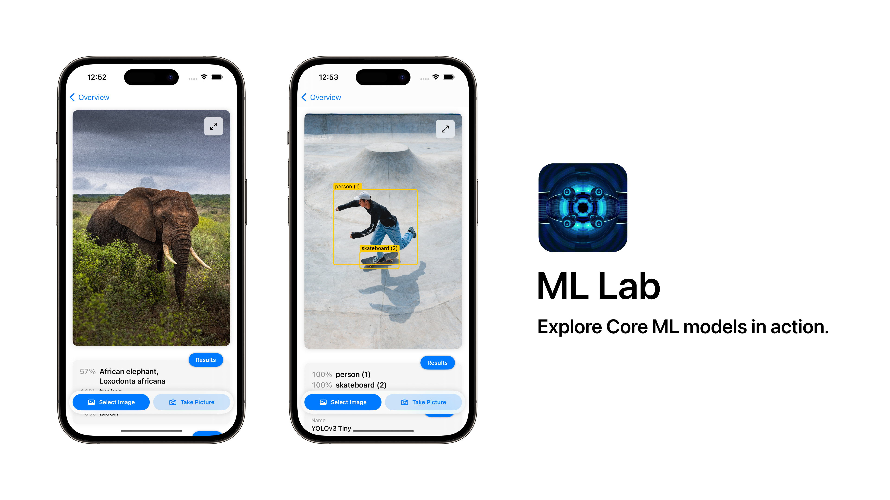
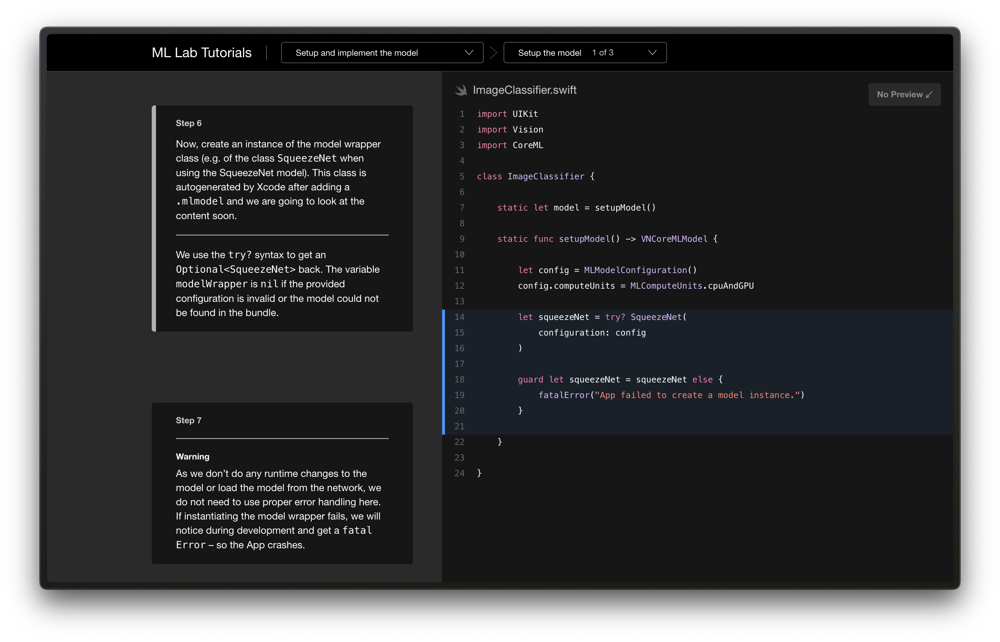

---

# ML Lab

Explore Core ML models in action.

This app is a collection of machine learning models. It was developed as part of a seminar talk on **»Training and implementing an image classifier using Create ML and Core ML«** for **iOS Application Development** at RWTH Aachen (Prof. Jan Borchers).

We implemented two models from the [Apple Developer Website](https://developer.apple.com/machine-learning/models/) and build an image classifier on our own with the Create ML framework.
 
Available models:
- Image Classifier
    - SqueezeNet
    - Cats and Dogs (trained by us using Create ML)
- Object Detector
    - YOLO Tiny Int8 LUT

## Tutorial

We have built a step-by-step tutorial to implement an image classifier using Core ML.
You can find it [here](https://lambdadigamma.github.io/ML-Lab/tutorials/tutorial-table-of-contents).

### Minimal reproduction sample

We have also included a minimal sample application which just loads an image from the assets and prints the results of the image classifier to the console.
You can find it in the folder "Image Classifier Example" and run it. This is also the code which is created in the step-by-step tutorial.

## Contributors

- Lennart Fischer
- Marvin Speks
- Jana Jachkovska

---

Disclaimer: Code, images and models are used for educational purposes only.
